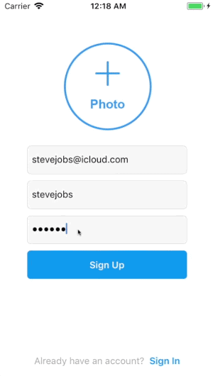
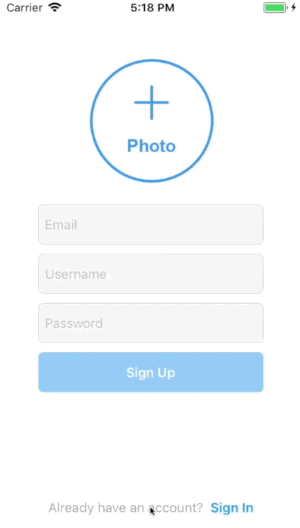
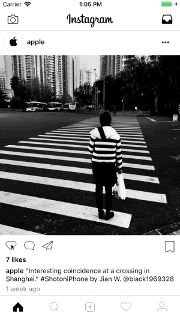

# InstagramClone
A detailed clone of the Instagram app built with Firebase.

# Features
* Firebase 5
* Swift 4.1

# Installation
1. Clone the repository
2. Create a new Firebase project in your Firebase [console](https://console.firebase.google.com/) by clicking "Add project"
3. Add the `GoogleService-Info.plist` file downloaded from Step 2 to the `InstagramClone` directory
4. Run the `InstagramClone` target on your device/simulator

# Screenshots

## Sign Up / Login
|  |  | 
|:---:|:---:|

## Home Feed
|  |  | 
|:---:|:---:|

More screenshots coming soon :)

# Author
Mac Gallagher, jmgallagher36@gmail.com

# License
InstagramClone is available under the [MIT License](LICENSE), see LICENSE for more infomation.
